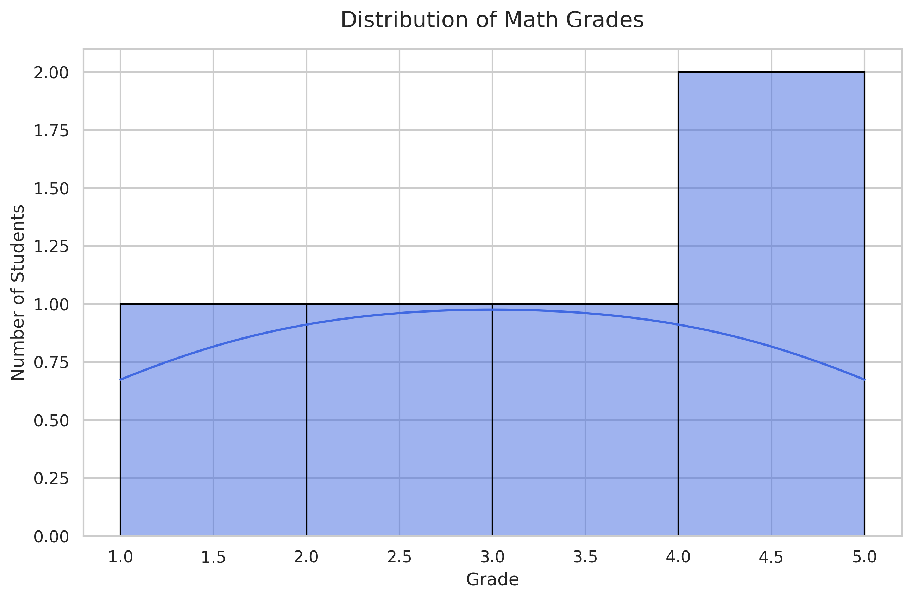
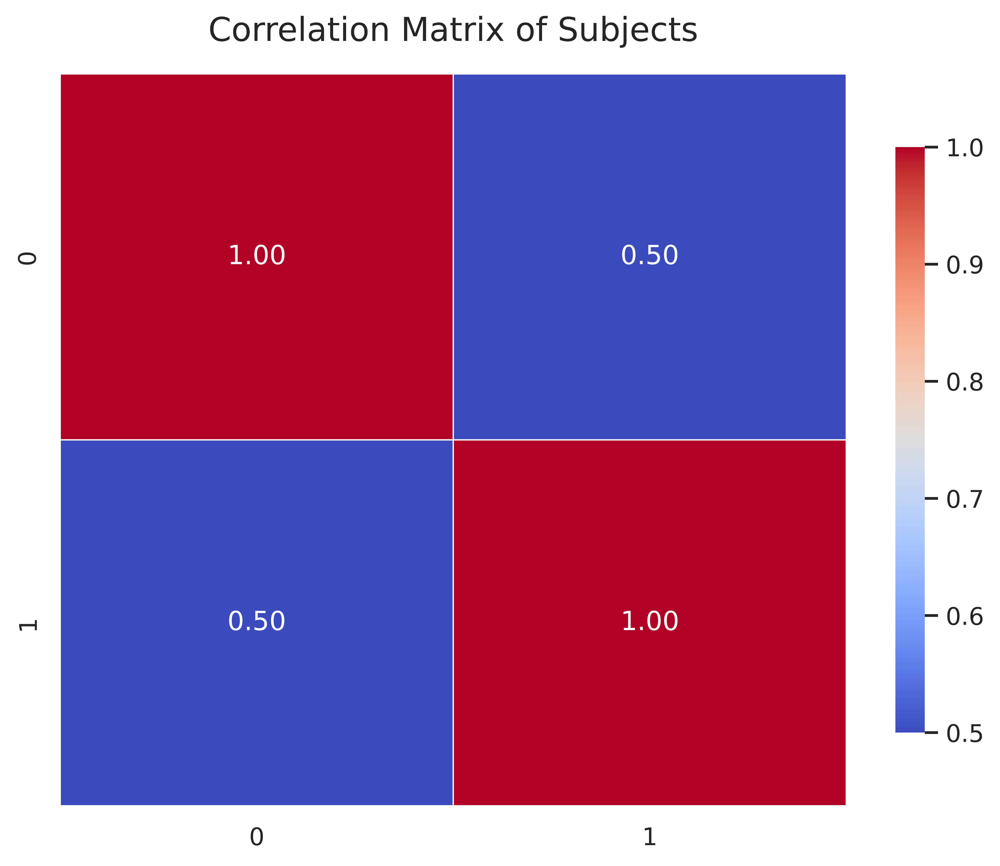

# Лабораторная работа №2

**Тема:** Численные вычисления и анализ данных с использованием NumPy

## Цель работы
Освоение библиотеки NumPy для эффективной работы с многомерными массивами, выполнения математических операций и базового статистического анализа данных.

## Задание
1. Реализовать функции создания и трансформации массивов (reshape, transpose).
2. Выполнить векторные и матричные операции (dot product, determinant, inverse).
3. Решить систему линейных уравнений (СЛАУ).
4. Провести статистический анализ данных из CSV-файла.
5. Визуализировать распределение данных и корреляцию.

## Код (фрагменты)

### Решение СЛАУ
```python
def solve_linear_system(a: np.ndarray, b: np.ndarray) -> np.ndarray:
    return np.linalg.solve(a, b)
```

### Статистический анализ
```python
def statistical_analysis(data: np.ndarray) -> Dict[str, float]:
    return {
        "mean": float(np.mean(data)),
        "median": float(np.median(data)),
        "std": float(np.std(data)),
        "p25": float(np.percentile(data, 25)),
        "p75": float(np.percentile(data, 75)),
    }
```

## Результаты визуализации

### Распределение оценок


### Корреляция предметов


### Прогресс студентов


## Выводы
Библиотека NumPy является мощным инструментом для научных вычислений. Векторизация операций позволяет значительно повысить производительность кода по сравнению с обычными циклами Python. В ходе работы были успешно применены методы линейной алгебры и статистики для анализа учебных достижений.


### [Исходный код](https://github.com/IR630/py_itmo/tree/main/sem2/laba_2)
